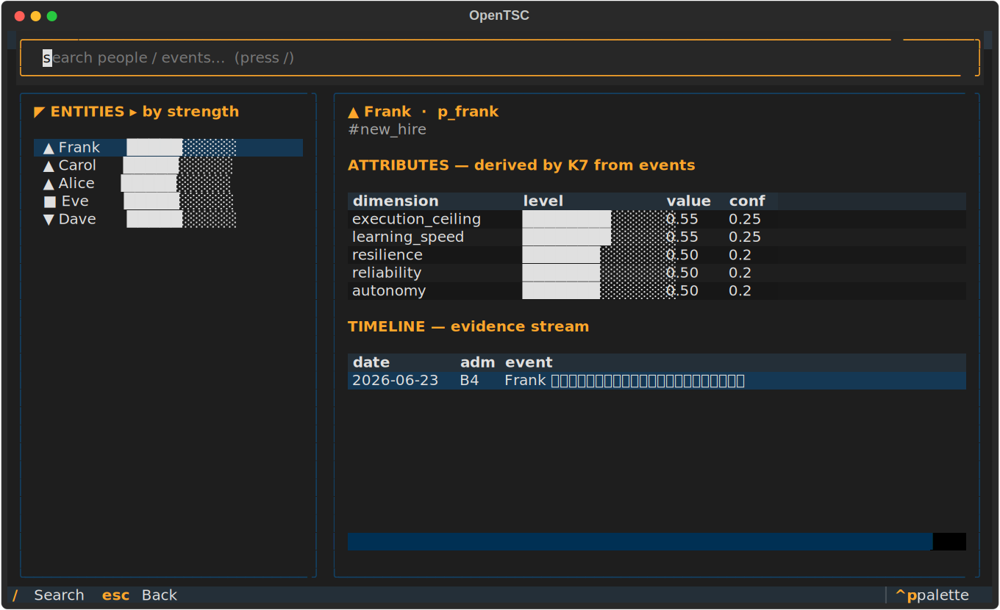

# OpenTSC — Intelligence Cockpit (TUI demo)

A keyboard-driven terminal cockpit over an OpenTSC vault, in the spirit of
[opencode](https://github.com/sst/opencode) / oh-my-openagent. **It's a demo** —
but it talks to the real `opentsc_core`: the attribute bars are what the **K7
judgment engine actually derived from events**, not mock data.



```
┌ ENTITIES ▸ by strength ┐ ┌ Carol · p_carol ───────────────────────┐
│ ▲ Carol   ██████░░░░    │ │ #core_team                              │
│ ▲ Frank   ██████░░░░    │ │ ATTRIBUTES — derived by K7 from events  │
│ ■ Eve     █████░░░░░    │ │  execution_ceiling ███████░░ 0.55       │
│ ▼ Dave    █████░░░░░    │ │  resilience        ███████░░ 0.55       │
└────────────────────────┘ │ TIMELINE — evidence stream              │
                           │  2026-06-21 A1  Carol 按时完成交付…      │
                           └─────────────────────────────────────────┘
```

## Run

```bash
pip install -r demo/requirements.txt     # just `textual`
python demo/seed.py                       # build demo/demo-vault (once)
python demo/opentsc_tui.py                # launch the cockpit
```

Needs a real terminal (TTY). The `opentsc_core` it imports has **zero extra
deps**, so only `textual` is required for the UI.

## Keys

| Key | Action |
|---|---|
| ↑ / ↓ | move through entities |
| `/` | focus search (people / tags / event content) |
| `r` | reload (clear search) |
| `esc` | back to the list |
| `q` | quit |

## What it shows

- **Left rail** — entities ranked by overall strength, each with a mood glyph
  (▲ rising · ■ steady · ▼ falling) and a strength bar.
- **Attributes** — the three-layer `base` attributes the judgment engine
  derived from events, each with its value bar and confidence.
- **Timeline** — the evidence stream (date · Admiralty rating · content).
- **Search** — filter by name, tag, or anything said in an entity's events.

The sample cast (Alice / Carol / Dave / Eve / Frank) and their events are
placeholder data defined in [`seed.py`](seed.py). `demo-vault/` is generated and
git-ignored — re-run `seed.py` anytime.

> Demo only. The cockpit is read-oriented; to record events, judge, or arrange
> tasks, use the CLI (`opentsc.py`) — see [`../docs/usage.md`](../docs/usage.md).
